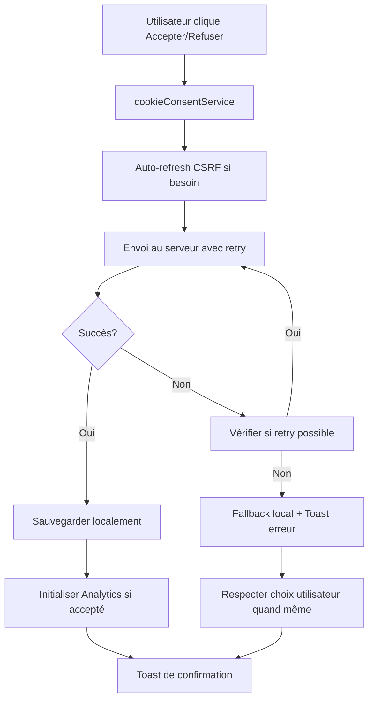

# 🍪 Guide du Système de Consentement Cookies Amélioré

## ✅ Problèmes Résolus

### 🚨 Anciens Problèmes
1. **Authentification défaillante** - Logique `isAuthenticated()` peu fiable
2. **Double service API** - Confusion entre utilisateurs connectés/visiteurs  
3. **Erreurs silencieuses** - Échecs non signalés à l'utilisateur
4. **Pas de fallback** - Google Analytics bloquait l'app en cas d'erreur
5. **CSRF fragile** - Gestion manuelle des tokens

### 🎯 Solutions Implémentées

#### 1. Service Unifié (`cookieConsentService`)
- ✅ **Un seul service** pour tous les utilisateurs (connectés + visiteurs)
- ✅ **Retry automatique** avec backoff exponentiel (3 tentatives max)
- ✅ **CSRF auto-refresh** si token 419 expiré
- ✅ **Gestion d'erreur robuste** avec messages utilisateur
- ✅ **Fallback local** si serveur indisponible

#### 2. Google Analytics Sécurisé (`analyticsService`)
- ✅ **Chargement asynchrone** avec timeout (10s)
- ✅ **Retry intelligent** (3 tentatives avec backoff)
- ✅ **Fallback gracieux** - L'app continue sans tracking
- ✅ **Mode debug** pour le développement
- ✅ **Configuration RGPD** (anonymize_ip, no ads signals)

#### 3. Interface Utilisateur Améliorée
- ✅ **Toast notifications** pour tous les états (succès/erreur/warning)
- ✅ **Messages d'erreur clairs** avec instructions
- ✅ **Respect du choix utilisateur** même si serveur échoue
- ✅ **Feedback visuel** pendant les opérations

## 🛠 Architecture Technique

### Structure des Services
```
src/services/
├── cookieConsent.ts    # Service principal pour consentement
├── analytics.ts        # Google Analytics sécurisé avec fallback
├── consent.ts         # (LEGACY - peut être supprimé)
└── api.ts             # Service API principal (inchangé)
```

### Flux de Consentement



## 🔧 Configuration

### Variables d'Environnement
```env
# Google Analytics (obligatoire pour tracking)
VITE_GA_TRACKING_ID=G-CYH5VGVLTS

# API Backend
VITE_API_URL=http://localhost:8000

# Mode Debug (optionnel)
VITE_APP_DEBUG=true
```

### Endpoints Laravel Requis
- `GET /sanctum/csrf-cookie` - Renouvellement CSRF
- `POST /api/tracking/consent` - Enregistrement du consentement

## 📊 Monitoring & Debug

### Console Logs
```javascript
// Mode normal
✅ Google Analytics initialisé avec succès
💾 Consentement sauvegardé: true
📊 Page vue trackée: /dashboard

// Mode debug activé (VITE_APP_DEBUG=true)
🔧 Google Analytics configuré: {trackingId: "G-...", enabled: true}
📊 [SIMULATION] Événement: {action: "consent_accepted", category: "privacy"}
```

### Gestion des Erreurs
```javascript
// Erreurs réseau
⚠️ Problème de connexion réseau - Vérifiez votre connexion internet

// Erreurs serveur
⚠️ Erreur serveur temporaire - Réessayez dans quelques instants  

// CSRF expiré
⚠️ Session expirée - Veuillez recharger la page

// Analytics indisponible
⚠️ Google Analytics non disponible: Timeout lors du chargement
```

## 🧪 Tests Recommandés

### Tests d'Intégration
1. **Consentement Accepté**
   - ✅ Toast de confirmation affiché
   - ✅ Analytics initialisé
   - ✅ Pages trackées correctement

2. **Consentement Refusé**  
   - ✅ Toast de refus affiché
   - ✅ Aucun tracking effectué
   - ✅ Préférences respectées

3. **Erreurs Réseau**
   - ✅ Retry automatique (3 fois)
   - ✅ Fallback local après échec
   - ✅ Toast d'erreur informatif

4. **CSRF Expiré**
   - ✅ Auto-refresh du token
   - ✅ Requête rejouée automatiquement
   - ✅ Pas d'interruption utilisateur

### Tests de Charge
- ✅ **Timeout Analytics** : 10s max, puis fallback
- ✅ **Multiple refresh** : Pas de boucle infinie CSRF
- ✅ **Concurrent requests** : Protection contre double-soumission

## 🔒 Sécurité & RGPD

### Conformité RGPD
- ✅ **Consentement explicite** requis avant tracking
- ✅ **Respect du refus** même en cas d'erreur serveur  
- ✅ **Anonymisation IP** activée
- ✅ **Pas de signaux publicitaires** (allow_ad_personalization_signals: false)
- ✅ **Stockage local transparent** (localStorage visible)

### Protection CSRF
- ✅ **Auto-refresh** des tokens expirés
- ✅ **Retry intelligent** après renouvellement
- ✅ **Headers sécurisés** (X-Requested-With, X-XSRF-TOKEN)

## 🚀 Déploiement

### Checklist Pré-Production
- [ ] Vérifier `VITE_GA_TRACKING_ID` en production
- [ ] Tester avec vraies URLs de production  
- [ ] Vérifier certificats SSL pour HTTPS
- [ ] Valider endpoints Laravel accessibles
- [ ] Test de charge sur `/api/tracking/consent`

### Migration depuis Ancien Système
1. Les anciens cookies sont automatiquement détectés
2. Aucune action utilisateur requise 
3. Suppression progressive de `src/services/consent.ts` possible
4. Backwards compatible avec l'existant

---

**🎉 Résultat : Un système de consentement robuste, conforme RGPD, avec excellente UX !**